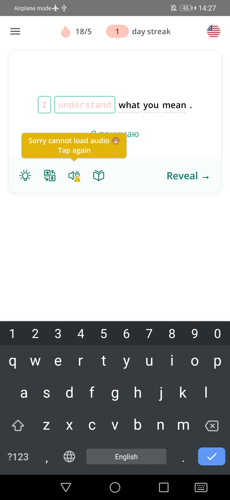
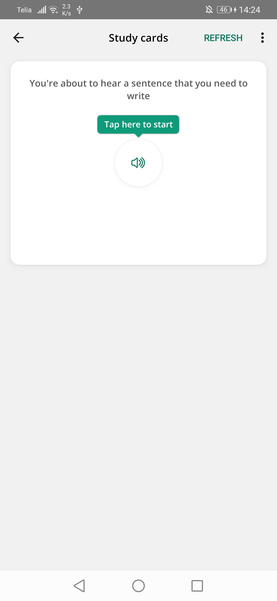

# sTooltip
sTooltip is a simple Tooltip flexible and self-adjusting kotlin Library for Android.

[  ](https://bintray.com/jesualex/sTooltip/cl.jesualex.stooltip/_latestVersion)



## Easy Use:

``` kotlin
            Tooltip.on(exampleTextView)
                .text(R.string.example)
                .icon(android.R.drawable.ic_dialog_info)
                .iconSize(30, 30)
                .color(resources.getColor(R.color.colorPrimary))
                .overlay(resources.getColor(R.color.overlay))
                .border(Color.BLACK, 1f)
                .clickToHide(true)
                .corner(5)
                .position(Position.TOP)
                .show(3000)
```

## First Steps

In your Project build.gradle you must have the following

``` gradle
buildscript {
    ...
    repositories {
        ...
        jcenter()
    }
    ...
    dependencies {
        ...
        classpath "org.jetbrains.kotlin:kotlin-gradle-plugin:$kotlin_version"
    }
    ...
}
```

In your App build.gradle you must have the following

``` gradle
...
apply plugin: 'kotlin-android'
apply plugin: 'kotlin-android-extensions'
...
dependencies {
    ...
    implementation 'cl.jesualex.android:stooltip:1.0'
}
```

## Options

#### Initialization of Builder

For your convenience, you can initialize the constructor only using the view to which you want the tooltip to refer, in that case the tooltip will be attached to the decorView(OVER ALL VIEWS)

`Tooltip.on(View)`

or if you wish you can add a root view and the tooltip will be ubicate inside of this view

`Tooltip.on(View, View)`

#### Builder options

Once the builder has been initialized, you can configure your tooltip, below you can briefly see the different methods you can use for that config

* To set text
`builder.text(text)`

* To set text color
`builder.textColor(colorInt)`

* To set text typeface
`builder.textTypeFace(typeface)`

* To set text size
`builder.textSize(textSize)`
`builder.textSize(unit, textSize)`

* To set text gravity
`builder.textGravity(TextViewGravity)`

* To enable a start icon(by default disabled)
`builder.iconStart(icon)`

* To set the start icon margin in px
`builder.iconStartMargin(left, top, right, bottom)`

* To set the start icon size in px
`builder.iconStartSize(h, w)`

* To enable a end icon(by default disabled)
`builder.iconEnd(icon)`

* To set the end icon margin in px
`builder.iconEndMargin(left, top, right, bottom)`

* To set the end icon size in px
`builder.iconEndSize(h, w)`

* To set a top drawable
`builder.drawableTop(drawable)`

* To set a bottom drawable
`builder.drawableBottom(drawable)`

* To set the tooltip bubble color
`builder.color(color)`

* To set the tooltip content padding in px
`builder.padding(top, right, bottom, left)`

* To set the position of the tooltip in relation to the view to which it points(by deafult Bottom)
`builder.position(position)`

* To set the corner radius in px of the tooltip bubble
`builder.corner(radius)`

* To enable autohide on tap(by default is enabled)
`builder.clickToHide(bool)`

* To set the distance in px between the tooltip and the view to which it points
`builder.distanceWithView(distance)`

* To set the the border color and width in px
`builder.border(color, width)`

* To set the the border margin in px
`builder.border(margin)`

* To enable and set a bubble shadow(by default bubble shadow radius is 0, it means shadow disabled)
`builder.shadow(radius)`
`builder.shadow(radius, color)`

* To set shadow padding
`builder.shadow(padding)`

* To set the arrow size
`builder.arrowSize(h, w)`

* To set a tooltip minWidth in px if the space in parent isn't enough the tooltip will be relocated to the opposite position
`builder.minWidth(w)`

* To set a tooltip minHeight in px if the space in parent isn't enough the tooltip will be relocated to the opposite position
`builder.minHeight(w)`

* To set a tooltip show/hide animation
`builder.animation(anim)`
`builder.animation(animIn, animOut)`

* To set a lifecycle listener to know when the tooltip has showed or hidden
`builder.displayListener(listener)`

* To set a click listener to catch when the user click the tooltip
`builder.tooltipClickListener(listener)`

* To set a click listener to catch when the user click the view to which the tooltip points
`builder.refViewClickListener(listener)`

* To enable overlay function and set a listener to catch when the user click the overlay(by default the overlay click has disabled, it means that if the user clicks in the overlay, that click will be send to the view under the overlay)
`builder.overlay(color)`
`builder.overlay(color, listener)`

#### Show options
After configure your tooltip just left show it, if you want set a duration in millis and the tooltip will be autohide after that time(by default autohide is disabled)

`builder.show()`
`builder.show(duration)`

This show method return a Tooltip instance, with which you can close, closeNow(without animation) and show it again

`tooltip.close()`
`tooltip.closeNow()`
`tooltip.show()`
`tooltip.show(duration)`
`tooltip.show(text)`
`tooltip.show(duration, text)`
`tooltip.isShown(): Boolean`

## Example

To get a small example, please [download this repo](/) and execute it

## Thanks to:

- [makks129](https://github.com/makks129) for tooltip screenshots

License
-------
    Copyright 2019 Jesualex. All rights reserved.
    
    Licensed under the Apache License, Version 2.0 (the "License");
    you may not use this file except in compliance with the License.
    You may obtain a copy of the License at
    
        http://www.apache.org/licenses/LICENSE-2.0
    
    Unless required by applicable law or agreed to in writing, software
    distributed under the License is distributed on an "AS IS" BASIS,
    WITHOUT WARRANTIES OR CONDITIONS OF ANY KIND, either express or implied.
    See the License for the specific language governing permissions and
    limitations under the License.